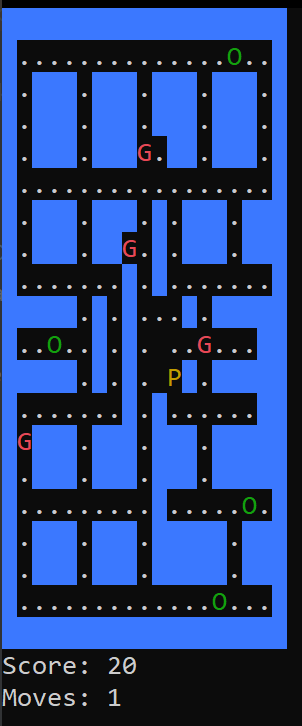

# SO2 - Pacman

### Spis treści
* [O projekcie](#o-projekcie)
* [Twórcy](#twórcy)
* [Funkcjonalność gry](#funkcjonalność-gry)
* [Dodatkowa funkcjonalność](#dodatkowa-funkcjonalność)
* [Ekran gry](#ekran-gry)
* [Wątki w programie](#wątki-w-programie)
* [Sekcje krytyczne](#sekcje-krytyczne)

---

## O projekcie
Założeniem projektu jest stworzenie gry typu Pacman, wyświetlającej się w terminalu i wykorzystującej do działania mechanizm wielowątkowości.

Gracz ma do dyspozycji różne mapy, losowo przydzielane podczas rozpoczęcia rozgrywki.

## Twórcy
inż. Maciej Radecki

Jacek Myjkowski

---
## Funkcjonalność gry
Podstawowa funkcjonalność gry opiera się na chodzeniu Pacmanem po mapie i zbieraniu punkcików. Gracz musi unikać duchów poruszających się losowo po mapie, nie gonią one Pacmana.

Gracz wygrywa, gdy zbierze z mapy wszystkie punkty.

Gracz przegrywa, gdy dotknie ducha.

## Dodatkowa funkcjonalność
Pacman ma możliwość zjedzenia ducha. Aby to zrobić, potrzebuje podnieść "power pellet", który na określony czas da mu taką umiejętność. W tym momencie ikonka Pacmana zmieni kolor z żółtego na zielony. Gdy czas działania power pelletu dobiegnie końca, Pacman z powrotem znowu stanie się żółty.

---
## Ekran gry

Aby nie rozpraszać uwagi gracza, wyświetlane są tylko najpotrzebniejsze informacje. Dlatego poza samą planszą wyświetlane są tylko punkty zdobyte przez gracza oraz ilość wykonanych przez niego ruchów.

### Poruszanie się po mapie:
Gracz do poruszania się po mapie używa strzałek na klawiaturze. Poruszanie się za pomocą klawiszy "WSAD" nie jest możliwe.

### Oznaczenia na planszy:
* Kolorem żółtym zaznaczony jest Pacman.
* Kolorem czerwonym oznaczone są duchy.
* Kolorem zielonym oznaczony jest power pellet oraz Pacman w czasie działania power pelletu.
* Kolorem białym oznaczone są punkciki do zebrania przez Pacmana.
* Na niebiesko są ściany oraz krawędzie mapy.

---

## Wątki w programie:
### 1. Pacman
W wątku tym działa funkcja "game_loop()", która odpowiada za poruszanie się Pacmana. Sprawdza on warunek naciśnięcia klawisza i na podstawie tego aktualizuje jego pozycję na mapie.

Wątek ten wywołując funkcję "move_pacman()" sprawdza również, czy pozycja Pacmana nie pokryła się z pozycją ducha. Jeśli się pokryła, to w zależności czy "power pellet model" jest aktywny, duch jest zjadany, albo Pacman przegrywa i gra się kończy"
### 2. Duchy
W wątku tym działa funkcja "move_ghosts()", która iteracyjnie porusza każdym z duchów.

Dla każdego z duchów losuje kierunek, w jakim duch się poruszy i jeśli ten kierunek jest dozwolony (tzn. nie ma tam ściany), to pozycja ducha jest aktualizowana na mapie.

Wątek ten również pilnuje pokrycia się pozycji ducha i Pacmana.

## Sekcje krytyczne:
Kontrolę nad sekcjami krytycznymi w grze sprawuje się za pomocą autorskiego semafora. Gdy jakaś z funkcji wchodzi do sekcji krytycznej, pobiera jeden jedyny dostępny żeton, więc do czasu, gdy się tam znajduje, żadna inna funkcja nie może wejść do sekcji krytycznej.

W sytuacji, gdy funkcja chce wejść do sekcji krytycznej, a żeton nie jest dostępny, zostaje wstrzymana i oczekuje w kolejce na zwolnienie żetonu i swoją kolej na jego pobranie.

